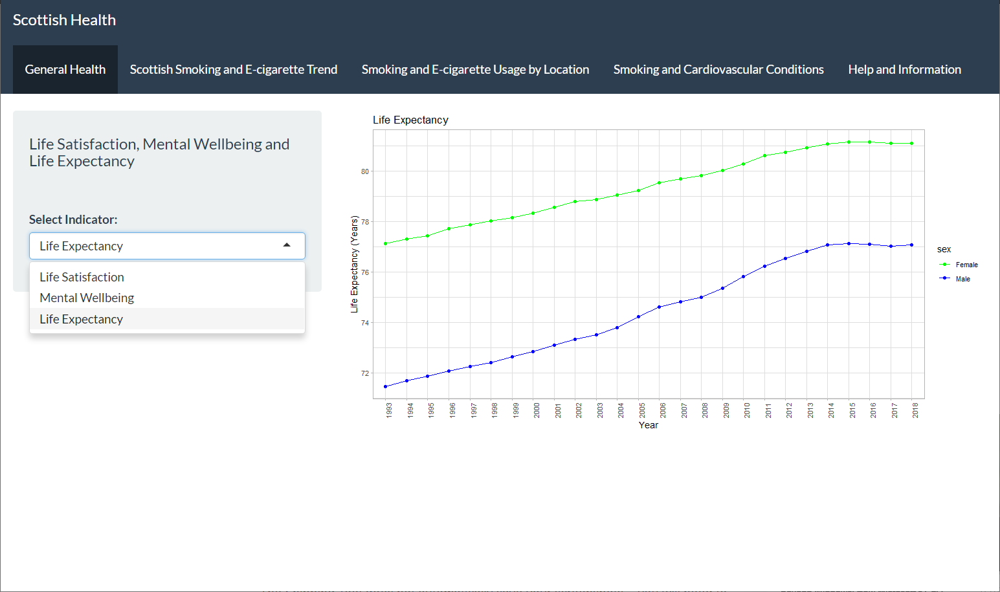
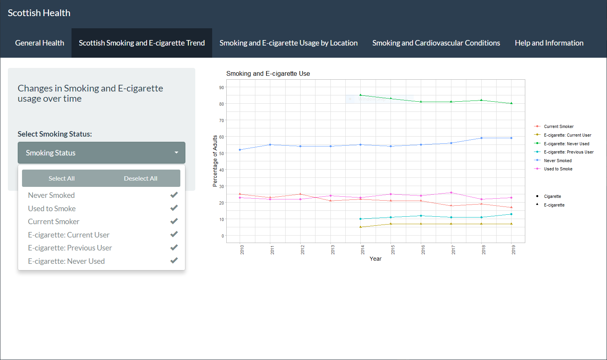
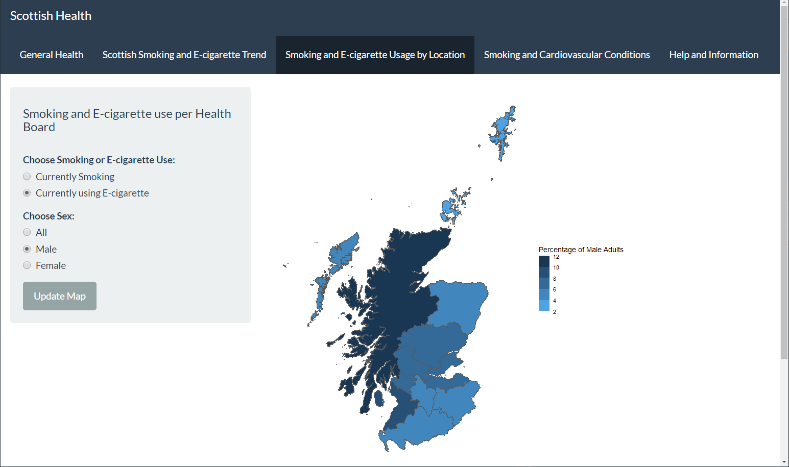
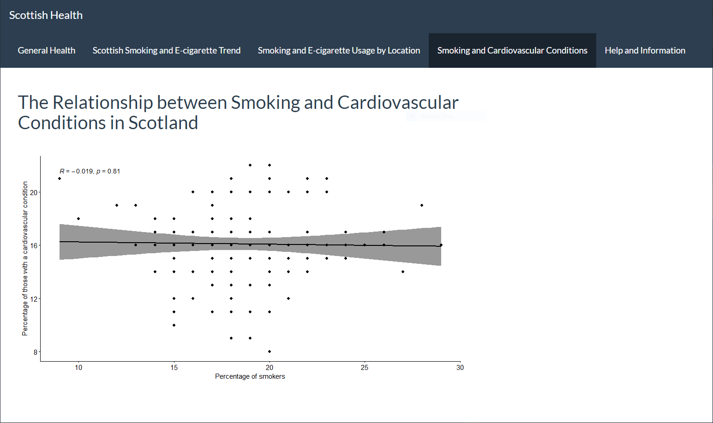
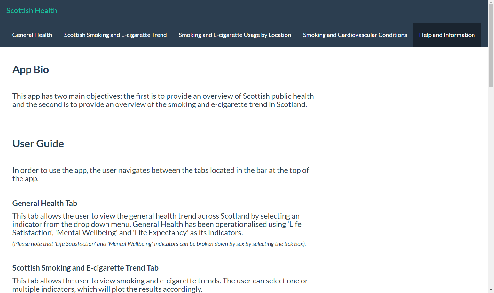

---
output:
  pdf_document: default
  html_document: default
---
# Scottish Smoking Trends App

This project was completed in collaboration with 3 others.

The first aim was to provide an interactive app that gives the user an overall indication of Scottish public health. Our second aim was to provide more detailed insight into a specific area of public health. For this we chose rates of smoking and e-cigarette use. 

The app is not currently hosted so an overview is provided below.

### Tab 1 - General Health

This tab provides a graph plotting either 'Life Satisfaction', 'Mental Wellbeing' or ' Life Expectancy' from 1993 to 2016. The user can choose which plot is displayed using the drop down menu.

 

 

### Tab 2 - Smoking Trends

This tab provides a plot of the rates of smoking and ecigarette use from 1993 to 2016. The user can select one or all of the options avaiable in the drop down menu.

 

 

### Tab 3 - Smoking and E-cig usage by location

This tab provides a reactive map that displays smoking or e-cigarette usage in each health board. The user can also filter by sex using the button selectors.

 

 

### Tab 4 - Smoking and Cardiovascular Conditions

This tab contains a plot showing an initial investigation into the correlation between smoking rates and reported cardiovascular conditions. Due to limitations in the data at hand we did not report a statistically significant relationship. This was an additional aim in the project and we would have pursued this further had we more time. 

 

 

### Tab 5 - Help and Information

This tab provides additional information about the data used and guidance for using the app.

 

 